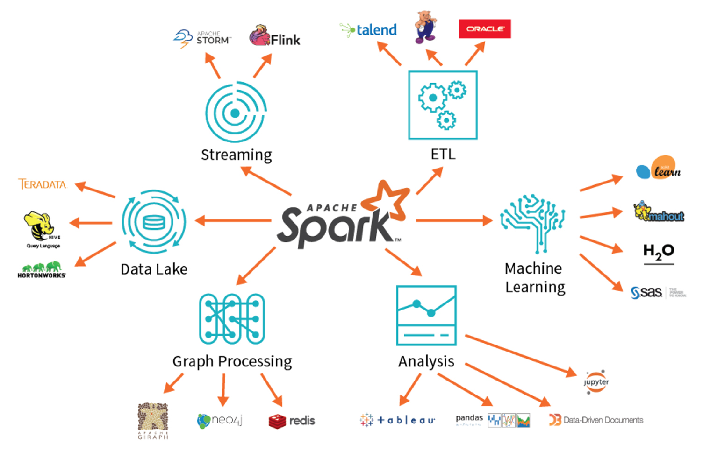

# Spark_MinProject

- Blog by altesoft / get to know about spark: https://www.altexsoft.com/blog/apache-spark-pros-cons/
- The goal of this project is to learn data processing using Spark with practical examples on datasets and also apply programming with Scala. 
- I've provided some references where you can learn about Spark. 
- Make sure you use a compatible version of Spark with Hadoop

</img>